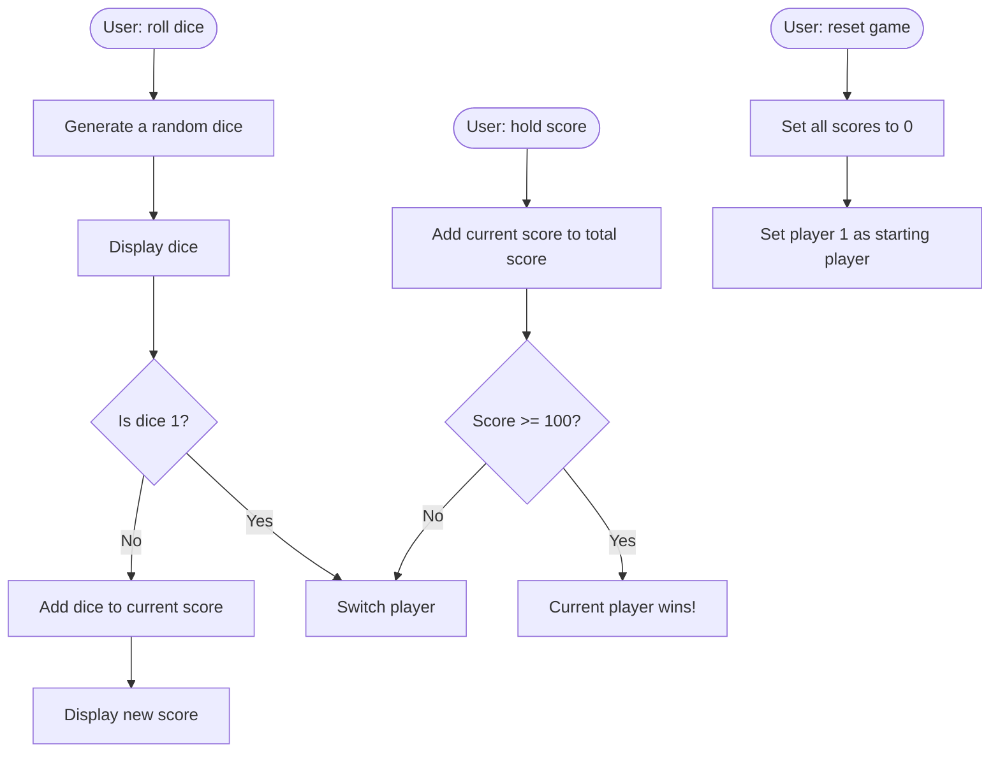

# PIG GAME

###### \*PIG GAME is one project I learned from [Jonas Schmedtmann](https://www.udemy.com/share/101WfeAEYbdllRRHQH/).

## BRIEF

A dice game | [**DEMO**](https://howiework.github.io/Pig-game/)

## KEYWORDS

DOM, JavaScript, Events

## FEATURES

### How To Play

1. Click ROLL DICE button to randomly generate a dice number between 1-6;
2. You can keep rolling the dice unless the dice number is 1 (see 4 to understand what would happen if the dice number is 1). All the dice numbers will add to your CURRENT score;
3. You can choose either HOLD, which will add your CURRENT score to your PLAYER 1/2 score (your final score) and then switch to the other player, or ROLL DICE unless the dice number is 1 (taking own risk :).
4. If the dice number is 1, you will automatically lose your CURRENT score and switch to the other player.

### About Scores

Whosever final score reaches 100 will win the game!

### Flowchart

